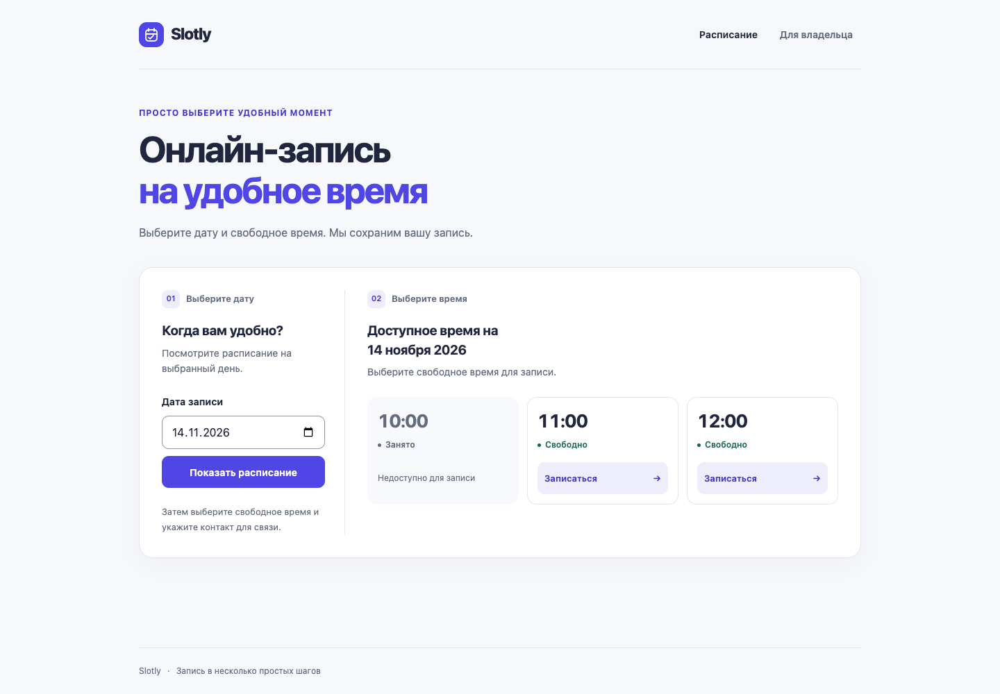
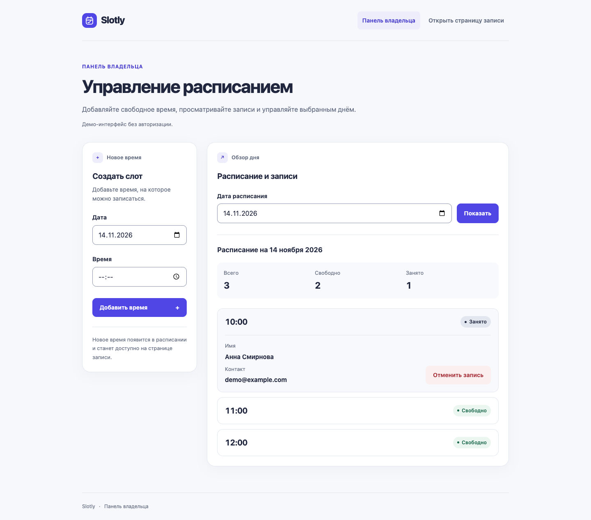

# Slotly

Slotly — учебный веб-сервис онлайн-записи на свободное время для малого бизнеса.
Владелец создаёт расписание, а клиент выбирает дату и время, оставляет имя и
контакт и получает подтверждение. Отмена записи освобождает время для повторного
бронирования.

**Slotly v1.0 — Status: Ready for submission.**

## Возможности

- Создание временных слотов в демо-панели владельца `/admin`.
- Публичное расписание с выбором даты, сортировкой по времени и статусами
  «Свободно» / «Занято» (`free` / `booked`).
- Бронирование свободного времени с сохранением имени, контакта и времени
  создания записи (`created_at`).
- Подтверждение записи и отмена через отдельную страницу подтверждения.
- Освобождение слота после отмены и повторное бронирование.
- Защита от повторного создания одинакового времени и двойного бронирования.
- Сводка дня, имя и контакт записанного клиента в панели владельца.
  В публичном расписании данные клиентов скрыты.
- Адаптивный публичный интерфейс и панель владельца; основные действия
  доступны с клавиатуры и работают без JavaScript.
- Хранение расписания и записей в SQLite между запусками приложения.

## Технологии

Python 3.11+, FastAPI, Uvicorn, SQLAlchemy 2.x, SQLite, Pydantic 2.x,
Jinja2, HTML5 и CSS3. Тестирование: pytest и HTTPX/TestClient.

## Структура проекта

```text
.
├── app/
│   ├── main.py                 # приложение, startup и health-check
│   ├── database/
│   │   ├── database.py         # SQLite engine, sessions и создание таблиц
│   │   └── models.py           # Slot и Booking
│   ├── schemas/
│   │   ├── booking.py          # проверка имени и контакта
│   │   └── slot.py             # проверка даты и времени
│   ├── services/
│   │   ├── bookings.py         # бронирование и отмена, транзакции
│   │   └── slots.py            # создание и выборка расписания
│   ├── routers/
│   │   ├── admin.py            # панель владельца
│   │   └── public.py           # расписание и клиентские формы
│   ├── static/
│   │   ├── favicon.svg
│   │   └── style.css
│   └── templates/              # base, _components и страницы интерфейса
├── data/
│   ├── .gitkeep
│   └── booking.db              # создаётся при запуске, исключён из Git
├── docs/
│   ├── TECH_SPEC.md
│   ├── SUBMISSION_CHECKLIST.md
│   └── screenshots/            # шесть снимков с вымышленными данными
├── tests/
│   ├── test_database.py
│   ├── test_slots.py
│   ├── test_bookings.py
│   ├── test_public_ui.py
│   └── test_admin_ui.py
├── .env.example
├── .gitignore
├── README.md
└── requirements.txt
```

Файлы `__init__.py` в Python-пакетах опущены для краткости.

## Быстрый запуск

Нужны Python 3.11 или новее и `pip`. Для нового клона не требуются готовое
окружение, файл базы данных или настройка переменных окружения.

```bash
git clone https://github.com/vahrus/slot-booking.git
cd slot-booking
python3 -m venv .venv
source .venv/bin/activate
python -m pip install -r requirements.txt
python -m uvicorn app.main:app --reload
```

На Windows вместо создания и активации окружения выше используйте PowerShell:

```powershell
python -m venv .venv
.venv\Scripts\Activate.ps1
```

Затем выполните те же команды установки зависимостей и запуска через `python`.
Убедитесь, что выбранный интерпретатор соответствует требованию Python 3.11+.

После запуска:

- [Публичное расписание](http://127.0.0.1:8000/)
- [Панель владельца](http://127.0.0.1:8000/admin)
- [Health-check](http://127.0.0.1:8000/health)
- [Документация FastAPI](http://127.0.0.1:8000/docs)

SQLite-файл `data/booking.db` и таблицы создаются автоматически при startup.
Путь определяется относительно корня проекта. База не хранится в Git; ручные
SQL-миграции для первого запуска v1.0 не нужны. Остановка сервера сохраняет
данные. `.env` для локального запуска не требуется.

## Использование

### Создание расписания

Откройте `/admin`, укажите дату и время и нажмите «Добавить время». Выберите
дату расписания, чтобы увидеть слоты и сводку дня. Одинаковые дата и время
повторно не создаются: интерфейс покажет понятную ошибку.

### Бронирование

В публичном расписании выберите ту же дату и свободное время. Укажите имя
и контакт: телефон, email или username в мессенджере. Оба поля обязательны,
пробелы по краям убираются, максимум — 100 символов на поле. После подтверждения
время станет «Занято». Сохраните адрес страницы подтверждения для отмены записи.

### Отмена записи

На странице подтверждения нажмите «Отменить запись», затем подтвердите действие.
Открытие страницы отмены само по себе запись не удаляет. Владелец может открыть
такую же форму из `/admin`; после отмены он вернётся к выбранному дню в панели.
Слот остаётся в расписании и снова доступен для записи.

### Короткая демонстрация

1. В `/admin` создайте три слота на одну дату: 10:00, 11:00 и 12:00.
2. В публичном расписании выберите эту дату и откройте запись на 10:00.
3. Введите вымышленные данные: `Анна Смирнова`, `demo@example.com`.
4. Подтвердите запись и сохраните адрес страницы подтверждения.
5. Проверьте статус «Занято» в расписании и данные клиента в `/admin`.
6. Снова откройте адрес формы бронирования, сохранённый на шаге 2:
   повторная запись блокируется сообщением «Это время уже занято».
7. Со страницы подтверждения откройте отмену; выберите «Оставить запись»,
   чтобы убедиться, что просмотр формы не меняет состояние.
8. Снова откройте отмену и подтвердите её. Время станет «Свободно».
9. Забронируйте его повторно, затем отмените запись из панели владельца.

## Защита от двойного бронирования

Перед записью приложение проверяет существование слота и статус `free`.
Ограничение `UNIQUE(bookings.slot_id)` в SQLite запрещает вторую запись даже
при конфликте запросов. Создание записи и изменение статуса выполняются одной
транзакцией; при конфликте изменения откатываются, пользователь получает
контролируемую ошибку `409`.

Отмена удаляет запись и возвращает слот в `free` одной транзакцией. Уникальность
самого времени защищена `UNIQUE(slots.date, slots.time)`.
Подробнее — в [технической спецификации](docs/TECH_SPEC.md).

## Интерфейс

Снимки реального интерфейса используют только вымышленные данные.

| Публичное расписание | Панель владельца с записью |
| --- | --- |
|  |  |

Другие состояния: [форма записи](docs/screenshots/02-booking-form.png),
[подтверждение](docs/screenshots/03-booking-success.png),
[свободное расписание владельца](docs/screenshots/04-admin-schedule.png),
[отмена на мобильном экране](docs/screenshots/06-cancellation.png).

## Тестирование

В активированном окружении из корня проекта:

```bash
python -m pytest -q
```

Тесты проверяют ограничения БД, persistence, создание и сортировку слотов,
валидацию, бронирование, конфликты, rollback, отмену, повторную запись,
HTTP-переходы, HTML escaping и границу приватности. Они используют отдельные
временные SQLite-базы и не изменяют `data/booking.db`.

## Ограничения MVP

- `/admin` не имеет authentication: это открытый учебный демо-интерфейс,
  показывающий имя и контакт клиента.
- Страницы подтверждения и отмены доступны по числовому идентификатору записи;
  нет проверки владельца записи, пользовательских сессий и CSRF-защиты.
- Нет аккаунтов, нескольких организаций, сотрудников и услуг, переноса или
  редактирования записей, уведомлений, оплаты и интеграций с календарями.
- Время слота — локальная дата и время без часового пояса; нет проверки,
  что дата находится в будущем.
- Используется SQLite без отдельной инфраструктуры для распределённой нагрузки
  и без системы миграций существующей схемы.

Проект предназначен для демонстрации учебного MVP, а не для эксплуатации
с реальными персональными данными в открытом доступе.

## Техническая документация

- [Техническая спецификация v1.0](docs/TECH_SPEC.md)
- [Проверка готовности к сдаче](docs/SUBMISSION_CHECKLIST.md)
